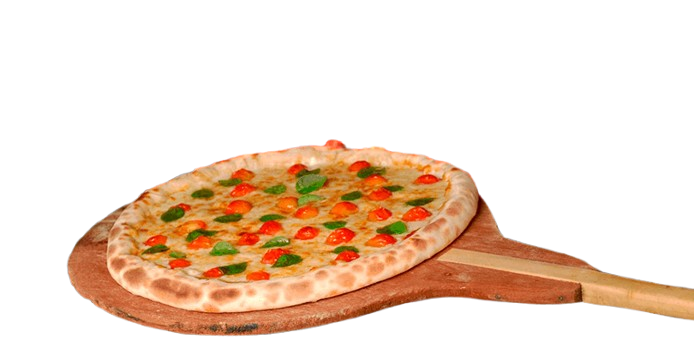

<div align="center">
  
  <h1>🍕 Pizzaria Arantes</h1>
  <p><strong>Sistema Web Completo para Pizzaria</strong></p>
  <p>
    
    
    
    
    
    
  </p>
</div>

---

## 📋 Sobre o Projeto

Sistema web completo para gerenciamento de pizzaria, desenvolvido como projeto da disciplina **Desenvolvimento Web Full Stack** do curso de **Análise e Desenvolvimento de Sistemas** da **Faculdade INSTED**.

O sistema conta com **site institucional** para os clientes e um **painel administrativo** completo para gerenciar pedidos, mensagens e cardápio em tempo real.

<p align="center">
  <strong>👨‍💻 Desenvolvido por:</strong> João Arantes &nbsp;|&nbsp;
  <strong>📅 Entrega:</strong> 19/06/2026
</p>

---

## ✨ Funcionalidades

### 🏪 Site (Cliente)

| Funcionalidade | Descrição |
|----------------|-----------|
| 🏠 **Página Inicial** | Hero section com CTA, estatísticas (500+ pedidos/mês, avaliação 4.9, entrega em 30min) e promoções exclusivas |
| 📖 **Sobre Nós** | História da pizzaria (fundada em 2010) com cards de estatísticas e valores |
| 🍕 **Cardápio Dinâmico** | Grade de pizzas carregadas do banco de dados com nome, descrição, preço e imagem |
| 📝 **Pedidos Online** | Formulário completo com validação dupla (JS + PHP): nome, telefone, sabor, tamanho, endereço, pagamento |
| 📬 **Contato** | Formulário de contato com seleção de assunto e armazenamento no banco |
| 👤 **Cadastro/Login** | Sistema de autenticação com sessão segura (`password_hash`, `session_regenerate_id`) |

### 🔧 Painel Administrativo (`/admin/`)

| Funcionalidade | Descrição |
|----------------|-----------|
| 📊 **Dashboard** | Cards com pedidos do dia, faturamento, total de pedidos, clientes, pizzas e mensagens não lidas |
| 🔄 **Auto Refresh** | Dashboard atualiza automaticamente a cada **15 segundos** via AJAX |
| 📦 **Gestão de Pedidos** | Tabela com últimos 20 pedidos e alteração de status inline (pendente → confirmado → entregue → cancelado) |
| ✉️ **Gestão de Mensagens** | Visualização e marcação de mensagens como lidas/não lidas |
| 🍕 **CRUD de Cardápio** | Adicionar, editar, excluir pizzas com upload de imagem (jpg/png/gif/webp, até 5MB) e opção de restaurar pizzas padrão |

### 🌟 Recursos Extras

- 🌙 **Modo Escuro (Dark Mode)** completo em todas as páginas
- 📱 **Design Responsivo** com 3 breakpoints (960px, 700px, 480px)
- 🍔 **Menu Hamburguer** para navegação mobile
- ✅ **Validação Dupla** em todos os formulários (front-end + back-end)
- 🔐 **Segurança:** Prepared Statements (PDO), `htmlspecialchars()`, hash de senha, controle de sessão

---

## 🛠️ Tecnologias Utilizadas

<div align="center">

| Tecnologia | Versão | Finalidade |
|------------|--------|------------|
|  **PHP** | 8.x | Back-end, sessões, autenticação, processamento de formulários |
|  **MySQL** | 8.x | Banco de dados relacional (5 tabelas) |
|  **HTML5** | — | Estrutura semântica das páginas |
|  **CSS3** | — | Estilização, responsividade, dark mode |
|  **JavaScript** | ES6 | Validação de formulários, menu mobile, auto-refresh |
| 🔗 **PDO** | — | Conexão segura com MySQL (prepared statements) |
| 🎨 **Google Fonts** | Poppins | Tipografia moderna |

</div>

---

## 🚀 Como Rodar o Projeto

### 📦 Pré-requisitos

- Servidor **Apache** + **PHP** 8.x + **MySQL** 8.x
- Recomendado: [XAMPP](https://www.apachefriends.org/) (Windows) ou LAMP (Linux)

### 🪟 Windows (XAMPP)

```bash
# 1. Copie o projeto para o htdocs
cp -r "Pizzaria Web" C:\xampp\htdocs\Pizzaria Web

# 2. Inicie Apache e MySQL no XAMPP Control Panel

# 3. Acesse o phpMyAdmin e crie o banco
# http://localhost/phpmyadmin
# → Novo → banco: pizzaria → Importar → database/banco.sql → Executar

# 4. Acesse o sistema
# http://localhost/Pizzaria%20Web
```

### 🐧 Linux (Ubuntu/Zorin OS)

```bash
# Instalar dependências
sudo apt install apache2 php libapache2-mod-php php-mysql mysql-server phpmyadmin -y

# Configurar senha do MySQL
sudo mysql -u root -e "ALTER USER 'root'@'localhost' IDENTIFIED WITH mysql_native_password BY '123456'; FLUSH PRIVILEGES;"

# Copiar projeto
sudo cp -r ~/Documentos/'Pizzaria Web' /var/www/html/'Pizzaria Web'

# Importar banco
sudo mysql -u root -p < ~/Documentos/'Pizzaria Web'/database/banco.sql

# Acessar: http://localhost/Pizzaria%20Web
```

> ⚠️ **Configuração:** Edite `includes/conexao.php` se sua senha do MySQL for diferente.

---

## 🔑 Credenciais de Acesso

<div align="center">

| Tipo | URL | E-mail | Senha |
|------|-----|--------|-------|
| 🌐 **Site** | `/Pizzaria%20Web` | — | — |
| 👤 **Login Cliente** | `/Pizzaria%20Web/login.php` | `joao@email.com` | `password` |
| 🔐 **Painel Admin** | `/Pizzaria%20Web/admin/login.php` | `admin@pizzaria.com` | `password` |
| 🗄️ **phpMyAdmin** | `/phpmyadmin` | `root` | `123456` |

</div>

---

## 📁 Estrutura do Projeto

```
📦 Pizzaria Web/
├── 📂 admin/
│   ├── 📄 cardapio.php        # CRUD do cardápio
│   ├── 📄 index.php           # Dashboard administrativo
│   ├── 📄 login.php           # Login do administrador
│   ├── 📄 logout.php          # Logout do admin
│   └── 📄 stats.php           # Endpoint JSON (auto-refresh)
├── 📂 CSS/
│   └── 📄 style.css           # Estilos globais + dark mode
├── 📂 database/
│   └── 📄 banco.sql           # Script completo do banco
├── 📂 IMG/                    # Imagens do projeto
├── 📂 includes/
│   ├── 📄 conexao.php         # Conexão PDO com MySQL
│   ├── 📄 footer.php          # Rodapé e scripts JS
│   └── 📄 header.php          # Header e navegação
├── 📂 JS/
│   └── 📄 main.js             # Validação de formulários
├── 📂 process/
│   ├── 📄 cadastro.php        # Cadastro de usuário
│   ├── 📄 contato.php         # Envio de mensagem
│   ├── 📄 login.php           # Autenticação
│   ├── 📄 logout.php          # Logout
│   └── 📄 pedido.php          # Registro de pedido
├── 📄 cadastro.php            # Página de cadastro
├── 📄 cardapio.php            # Cardápio dinâmico
├── 📄 contato.php             # Página de contato
├── 📄 index.php               # Página inicial
├── 📄 login.php               # Login do cliente
├── 📄 pedidos.php             # Formulário de pedido
├── 📄 sobre.php               # Sobre a pizzaria
└── 📄 README.md               # Este arquivo
```

---

## 🗄️ Banco de Dados

### Esquema

| Tabela | Descrição |
|--------|-----------|
| `usuarios` | Clientes e administradores (id, nome, email, senha, telefone, tipo) |
| `enderecos` | Endereços vinculados aos usuários |
| `cardapio` | Pizzas cadastradas (nome, descrição, preço, imagem, ativo) |
| `pedidos` | Pedidos realizados (cliente, pizza, tamanho, endereço, status, total) |
| `mensagens` | Mensagens do formulário de contato |

---

## 🔒 Segurança

- ✅ **Prepared Statements** (PDO) — proteção contra SQL Injection
- ✅ **Senhas hasheadas** com `password_hash()` (bcrypt)
- ✅ **Regeneração de sessão** com `session_regenerate_id()`
- ✅ **Validação dupla** — front-end (JavaScript) e back-end (PHP)
- ✅ **Sanitização de saída** com `htmlspecialchars()`
- ✅ **Controle de acesso** por tipo de usuário (admin/cliente)
- ✅ **Upload seguro** — validação de formato e tamanho de imagens

---

## 📞 Contato

<div align="center">

**👨‍🎓 João Arantes** — Análise e Desenvolvimento de Sistemas — Faculdade INSTED

[](https://github.com/joaovitorarantes86-ui)

</div>

---

<div align="center">
  <p>🍕 <strong>Arantes Pizzaria</strong> — "O sabor que aproxima as pessoas"</p>
  <p>📍 Campo Grande, MS</p>
  <br>
  <p>
    
    
    
  </p>
</div>
